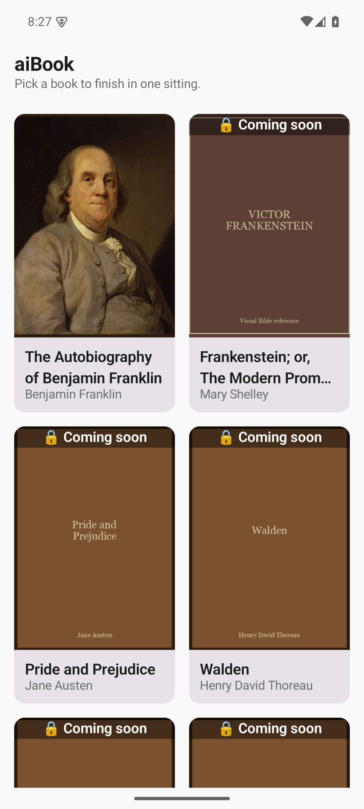
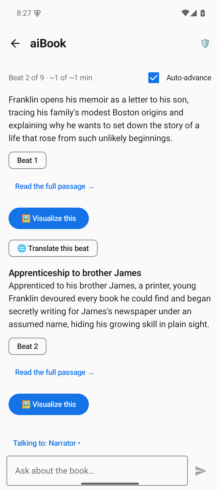
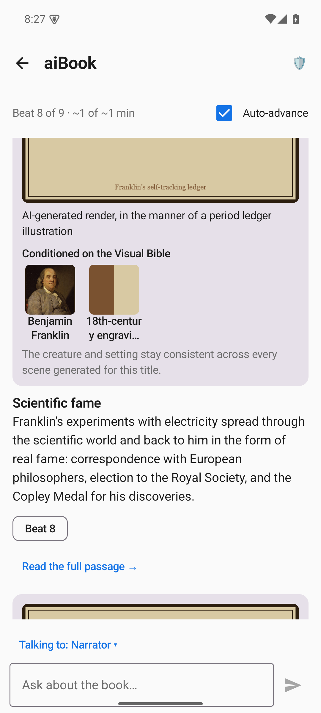
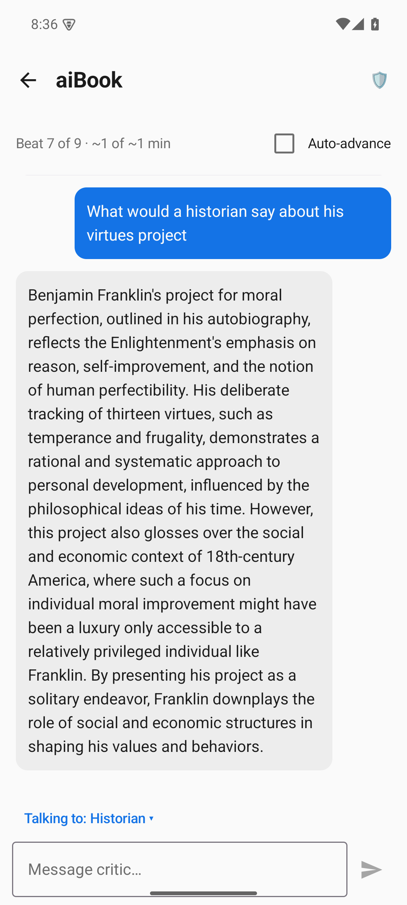
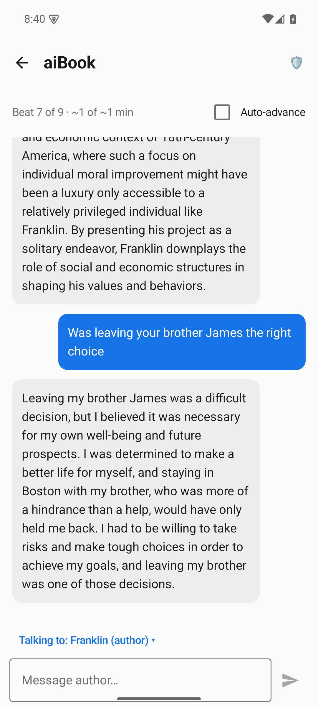
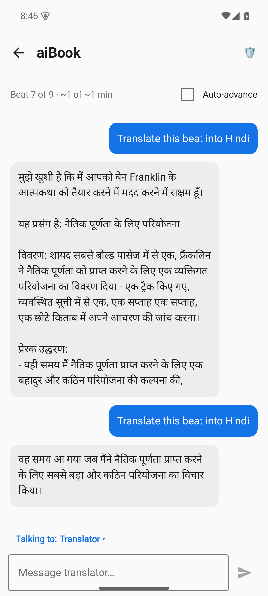

# aiBook

An AI-native reading experience: turn a book into a grounded, visual, conversational
digest. A single canned book (Benjamin Franklin's *Autobiography*) is narrated as an
auto-advancing **beats feed** with citations, on-demand **visuals**, spoiler-gated
**Q&A**, live **agent personas**, an end-of-read **recap quiz**, and a
**Rights-Preserving Grounding (RPG)** audit that proves no raw book text is ever sent to
the model.

## Screenshots

Captured live from the Android app running against the deployed Worker.

<table>
  <tr>
    <td align="center" width="33%">
      <br>
      <sub><b>Library</b> — pick a book</sub>
    </td>
    <td align="center" width="33%">
      <br>
      <sub><b>Beats feed</b> — narrated, with citations</sub>
    </td>
    <td align="center" width="33%">
      <br>
      <sub><b>Visualize</b> — scenes on the Visual Bible</sub>
    </td>
  </tr>
  <tr>
    <td align="center" width="33%">
      <br>
      <sub><b>Historian</b> — live agent persona</sub>
    </td>
    <td align="center" width="33%">
      <br>
      <sub><b>Debate the author</b> — in Franklin's voice</sub>
    </td>
    <td align="center" width="33%">
      <br>
      <sub><b>Translate</b> — any beat, any language</sub>
    </td>
  </tr>
</table>

This repo has two parts:

## `aibook-worker/` — API backend (Cloudflare Worker)
TypeScript Worker (Hono) that serves the JSON API and book media from one origin. Book
data is canned; the RPG spoiler-gate and audit logic are computed, not hardcoded; agent
personas run on **Cloudflare Workers AI** with a canned fallback.

```bash
cd aibook-worker
npm install
npm run dev        # http://127.0.0.1:8787
npm run deploy     # https://<name>.<subdomain>.workers.dev
```

Key endpoints: `GET /api/titles`, `GET /:id/beats`, `POST /:id/chat`,
`POST /:id/visualize`, `GET /:id/recap-quiz` + `POST /:id/recap-quiz/grade`,
`POST /:id/agents/:type/message`, `GET /:id/rpg/proof`, images at `/media/...`.

## `aibook-android/` — native Android app (Kotlin + Jetpack Compose)
Full-parity mobile client: catalog, auto-advancing beats feed, grounded chat with
citations + spoiler gate, visualize, live agent personas, recap quiz, and the RPG
receipts drawer. MVVM + Hilt + Retrofit/kotlinx.serialization + Coil.

Open `aibook-android/` in Android Studio and Run, or:
```bash
cd aibook-android
./gradlew assembleDebug     # debug build talks to http://10.0.2.2:8787 (emulator -> local worker)
./gradlew assembleRelease   # release build uses AIBOOK_API_BASE_URL from gradle.properties
```
Set `AIBOOK_API_BASE_URL` in `aibook-android/gradle.properties` to your deployed Worker URL.

> Release signing is optional and local-only: drop an `aibook-android/keystore.properties`
> (with `storeFile`, `storePassword`, `keyAlias`, `keyPassword`) next to a keystore to
> produce a signed release build. Both are git-ignored.

## Architecture note
The Worker is stateless: the RPG audit entry is returned with each chat/visualize/agent
response and accumulated client-side, so the audit drawer shows a clean per-session log.
